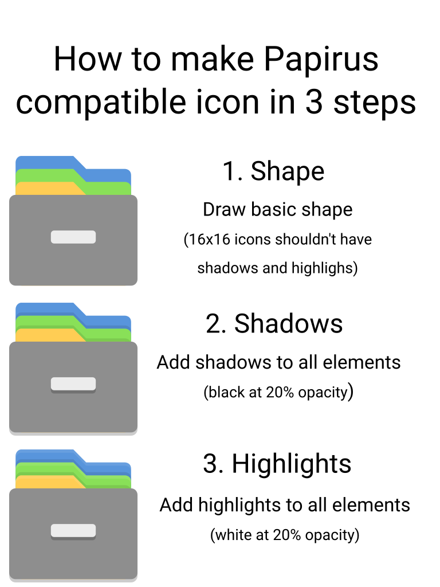

# For Developers and Designers

Designing icons for Origami is easy :)

You only need to draw icons for Origami and then convert colors for eOrigami, Origami Dark and Origami-Light using our scripts.

## Basic concepts



Mainly single size for all icons (without shadow):

- 16px draw 16px icon
- 22px draw 20px icon
- 24px draw 20px icon
- 32px draw 28px icon
- 48px draw 40px icon
- 64px draw 56px icon

#### Main icons

Main icons have the following sizes: 16px, 22px, 24px, 32px and 48px. Also available are some 64px icons for Apps, Devices, Places and Mimes.

> Why do we need so many sizes for an SVG?

Because if we use a single size for all then the icons will be blurred. All objects on Origami have pixelated alignment.

Keeping this in mind, **please do not use** very bright and toxic colors for Origami.

For compabillity with mostly GTK Themes we use this palette:

- white `#cccccc`
- black `#4f4f4f`

For devices used material colors:

- steel `#afafb1`
- aluminium `#e0e077`
- plastic `#4f4f4f`

Examples are available in the main icon theme folders. In the `work` directory, you'll only find templates and scripts.

#### Monochrome icons

Origami now also supports KDE color scheme for monochrome actions, devices, places and panel icons. You can find more detailed info about that [here](https://techbase.kde.org/Development/Tutorials/Plasma5/ThemeDetails#Colors).

Presently we only support the following icons:

- actions (16px, 22px, 24px)
- devices (16px)
- places (16px)
- panel (22px, 24px)

## System Requirements

- Inkscape
- scour

For Debian/Ubuntu/Linux Mint users:

```
sudo apt update
sudo apt install inkscape python-scour
sudo pip install --upgrade scour
```

## Step-by-Step Guide

### 1. Getting Started

Open directory `work` in a file manager and open a terminal in the directory. You can do it from the context menu entry `Open in Terminal` or `Action → Open Terminal Here`.

- #### Create a new icon

    Create a new icon from the provided template using the script `tools/work/new-icon.sh`. For all new icons, **please stick to using the template**. It is necessary because the template already has some needed objects, like a CSS stylesheet.

    ```sh
    # For example

    ./new-icon.sh apps abricotine

    # It creates the following files inside work directory
    # from the template files:
    #
    # ./Origami/apps/abricotine@16x16.svg
    # ./Origami/apps/abricotine@22x22.svg
    # ./Origami/apps/abricotine@24x24.svg
    # ./Origami/apps/abricotine@32x32.svg
    # ./Origami/apps/abricotine@48x48.svg
    # ./Origami/apps/abricotine@64x64.svg
    ```

- #### Edit an existing icon

    If you want to modify an existing icon, you can do that using the script `tools/work/get-from-theme.sh`.

    ```sh
    # For example

    ./get-from-theme.sh panel transmission-tray-icon.svg

    # It copies following files into work directory from the
    # main icon theme folders:
    #
    # ./Origami/panel/transmission-tray-icon@22x22.svg
    # ./Origami/panel/transmission-tray-icon@24x24.svg
    ```

- #### Make symlinks to an existing icon

    Make sure those icons exist:

    ```sh
    find ../../Origami -type f -iname '*ardour*' -print

    # ./Origami/16x16/apps/ardour.svg
    # ./Origami/22x22/apps/ardour.svg
    # ./Origami/24x24/apps/ardour.svg
    # ./Origami/32x32/apps/ardour.svg
    # ./Origami/48x48/apps/ardour.svg
    # ./Origami/64x64/apps/ardour.svg
    ```

    Great, it's true, now you have the filename of the icon, it's `ardour.svg`, and the symlink name, it's `ardour5`. Create symlinks with the command:

    ```sh
    # Usage: ./new-symlink.sh context <icon filename> <symlink name>...

    ./new-symlink.sh apps ardour.svg ardour5
    ```

    **NOTE:** Symlinks will look like broken but is ok.

    If your symlinks are in apps, emblems or mimetypes you can continue from step **4.3**, else continue from step **3**.

**IMPORTANT:** Please don't remove suffixes from the filename as it's needed for other scripts. Filename extension must be in lowercase.

### 2. Origami

1. Open the created/copied file in Inkscape.
2. Delete any objects you do not need.
3. Draw new objects.
4. Save the file with the same filename.
5. Repeat it for other sizes.

### 3. Origami Dark

1. Run script `tools/work/convert.sh`. It copies needed icons from `work/Origami` to `work/Origami-Dark`, `work/Origami-Light` and `work/eOrigami` and changes their color schemes.

    **IMPORTANT:** You should draw icons for Origami first.

    ```sh
    ./convert.sh
    ```

2. Check result and edit manually if needed.

### 4. Final Steps

1. Run script `tools/work/prepare.sh` to clean the created icons:

    ```sh
    ./prepare.sh
    ```

2. Please check your icons again.
3. If everything is fine then put the icons into main icon theme folders:

    ```sh
    ./put-into-theme.sh
    ```

4. Clean the `work` directory:

    ```sh
    ./clean.sh
    ```

5. Run tests:

    ```sh
    make tests
    ```

6. Everything is ready now! You can commit the changes to GitHub.
